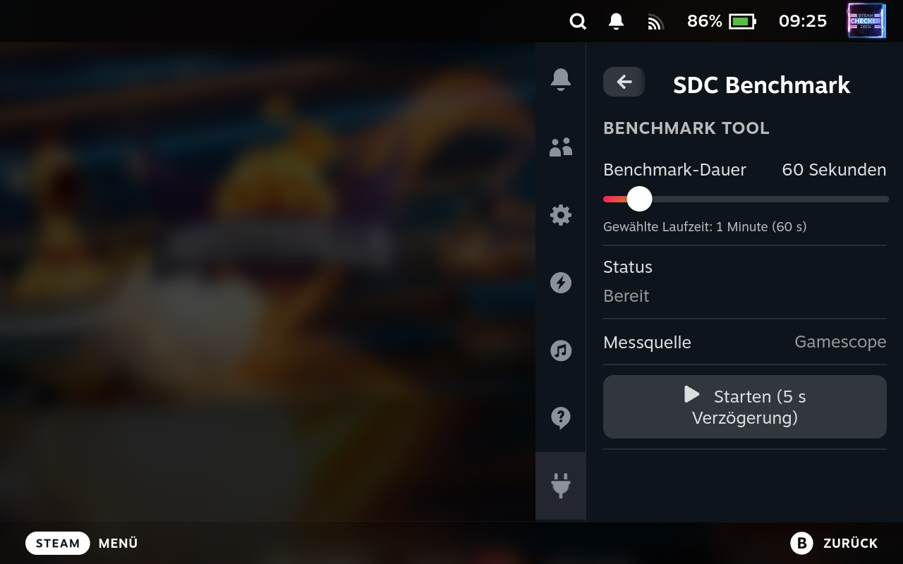
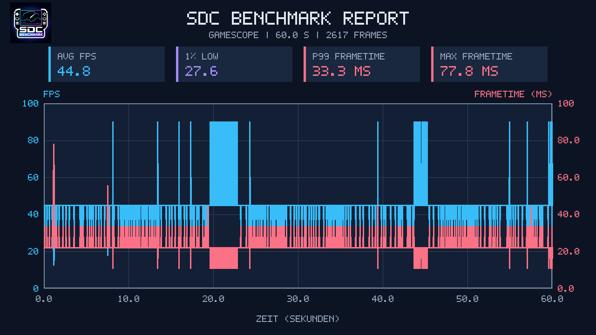

  

<h1 align="center">SDC Benchmark</h1>

  A Decky Loader plugin for real FPS and frametime benchmarks on the Steam Deck.

  
  
  

## About the Plugin

**SDC Benchmark** records the frametimes reported by Gamescope while you play
and calculates the actual FPS values from them. After a benchmark is completed,
the plugin automatically generates a detailed CSV file and a clear PNG report.

Measurements are taken directly in SteamOS Gaming Mode. MangoHud, <code>matplotlib</code>,
NumPy, Pillow, and additional Python packages are not required.

## Features

- Captures real FPS and frametime values via Gamescope
- Benchmark duration from 30 seconds to 6 minutes
- Adjustable in 30-second increments
- Five-second start delay for switching back to the game
- Live display of the status, remaining time, and number of captured frames
- Audio signal when the measurement starts and finishes
- Automatic CSV export of all captured frames
- Automatic PNG report at a resolution of 1280 × 720 pixels
- Preview of the most recently generated PNG report directly in the Decky plugin
- SDC Benchmark logo embedded in the generated report
- No internet connection or external Python dependencies required

## Requirements

- Steam Deck running SteamOS
- Current version of [Decky Loader](https://decky.xyz/)
- SteamOS Gaming Mode with Gamescope Control interface version 6 or later
- A running and focused game

> [!IMPORTANT]
> The game you want to measure must be focused when the five-second countdown
> ends. Otherwise, Gamescope may not be able to provide the relevant frame data.

## Installation

### Installation via Decky Loader

1. Download the latest ZIP file from the **Releases** section.
2. Enable Developer Mode in the Decky settings.
3. Select **Install Plugin from ZIP File** in the Developer menu.
4. Install the downloaded ZIP file.
5. Restart Decky Loader or Steam.

### Manual Installation

1. Create a folder named <code>sdc-benchmark</code> at the following path:

   ~~~text
   /home/deck/homebrew/plugins/sdc-benchmark
   ~~~

2. Extract the contents of the distribution archive into this folder.
3. Restart Steam or the Steam Deck.

## Usage

1. Launch the game you want to benchmark.
2. Open the Quick Access Menu and select **SDC Benchmark**.
3. Set the benchmark duration between 30 seconds and 6 minutes.
4. Select **Start**.
5. Switch back to the game before the five-second countdown ends.
6. Play normally until you hear the completion signal.
7. Open the report afterward by selecting **Show Last PNG** in the plugin.

A running benchmark can be stopped at any time by selecting **Cancel**.

## Output Files

All reports are saved in the Deck user's Downloads folder:

~~~text
/home/deck/Downloads
~~~

The filenames contain the date and time of the measurement:

~~~text
benchmark_2026-08-20_18-30-00.csv
benchmark_2026-08-20_18-30-00.png
~~~

### CSV File

The CSV file contains the following values for every frame reported by Gamescope:

| Column | Description |
| --- | --- |
| <code>Timestamp_s</code> | Time since the start of the benchmark in seconds |
| <code>FPS</code> | Frame rate calculated from the frametime |
| <code>Frametime_ms</code> | Duration of the frame in milliseconds |

The file can be processed further using Microsoft Excel, LibreOffice Calc, or
Google Sheets, for example.

### PNG Report

The automatically generated report includes:

- FPS and frametime graphs
- Average FPS
- 1% low FPS
- P99 frametime
- Maximum frametime
- Measurement duration and number of captured frames
- Measurement source used
- SDC Benchmark logo

The PNG renderer is included entirely within the plugin and relies exclusively
on the Python standard library.

## Measurement Method

Gamescope provides the time between two presented frames in nanoseconds through
its private Wayland Control protocol. SDC Benchmark converts these values into
milliseconds and calculates the FPS:

~~~text
FPS = 1000 / frametime in milliseconds
~~~

This means that no simulated placeholder values are used. The plugin records
data from the application that is focused in Gamescope when the measurement
starts.

## Troubleshooting

### The Benchmark Remains Stuck on “Initializing …”

- Check that Decky Loader and the plugin are up to date.
- Restart Decky Loader or Steam.
- Make sure the plugin was installed completely and that <code>main.py</code>,
  <code>py_modules</code>, and <code>dist/index.js</code> are present.

### Gamescope Does Not Provide Any Frames

- Run the benchmark in SteamOS Gaming Mode.
- Switch back to the running game before the countdown ends.
- Close overlays or menus that might take focus away from the game.
- Update SteamOS to a current version.

### No PNG Report Is Generated

A PNG is generated only if Gamescope provides at least one valid frame. The CSV
file and any available error message are displayed in the plugin.

## Development and Build

The project is based on the official
[Decky Plugin Template](https://github.com/SteamDeckHomebrew/decky-plugin-template)
and uses <code>@decky/ui</code> and <code>@decky/api</code>.

## Privacy

SDC Benchmark operates entirely locally. The plugin does not transmit benchmark
data or any other information to external servers.

## License

This project is released under the [BSD 3-Clause License](LICENSE). Parts of the
Gamescope protocol definitions used by the plugin are based on
<code>gamescope-control.xml</code> by Valve Corporation. Additional information
can be found in the license file.

---

  Developed by <strong>Fabian Petrusky</strong> for the Steam Deck community.

