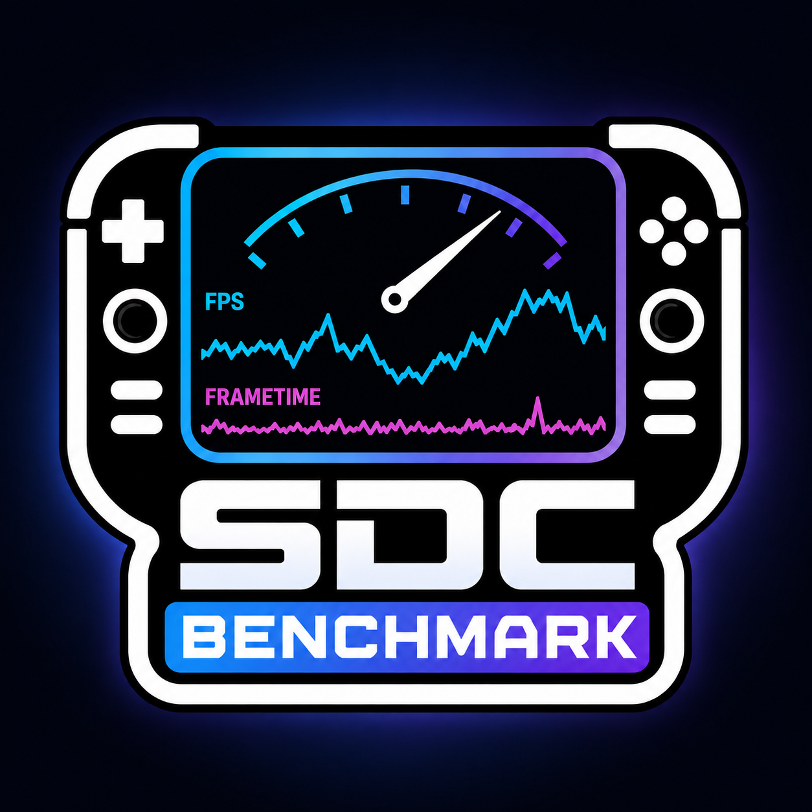

<p align="center">
  
</p>

<h1 align="center">SDC Benchmark</h1>

<p align="center">
  Ein Decky-Loader-Plugin für echte FPS- und Frametime-Benchmarks auf dem Steam Deck.
</p>

<p align="center">
  
  
  
</p>

## Über das Plugin

**SDC Benchmark** zeichnet während des Spielens die von Gamescope gemeldeten
Frametimes auf und berechnet daraus die realen FPS-Werte. Nach Abschluss eines
Benchmarks erstellt das Plugin automatisch eine detaillierte CSV-Datei und
einen übersichtlichen PNG-Bericht.

Die Messung erfolgt direkt im SteamOS-Gaming-Modus. MangoHud, `matplotlib`,
NumPy, Pillow oder zusätzliche Python-Pakete werden nicht benötigt.

## Funktionen

- Erfassung echter FPS- und Frametime-Werte über Gamescope
- Benchmark-Dauer von 30 Sekunden bis 6 Minuten
- Einstellung in 30-Sekunden-Schritten
- Fünf Sekunden Startverzögerung zum Wechseln ins Spiel
- Live-Anzeige von Status, Restzeit und Anzahl der erfassten Frames
- Akustisches Signal beim Start und Abschluss der Messung
- Automatischer CSV-Export aller erfassten Frames
- Automatischer PNG-Bericht im Format 1280 × 720 Pixel
- Vorschau des zuletzt erzeugten PNG-Berichts direkt im Decky-Plugin
- SDC-Benchmark-Logo im generierten Bericht
- Keine Internetverbindung und keine externen Python-Abhängigkeiten erforderlich

## Voraussetzungen

- Steam Deck mit SteamOS
- Aktueller [Decky Loader](https://decky.xyz/)
- SteamOS-Gaming-Modus mit Gamescope-Control-Schnittstelle ab Version 6
- Ein gestartetes und fokussiertes Spiel

> [!IMPORTANT]
> Beim Ende des fünfsekündigen Countdowns muss das zu messende Spiel fokussiert
> sein. Andernfalls kann Gamescope keine passenden Frame-Daten liefern.

## Installation

### Installation über Decky Loader

1. Die aktuelle ZIP-Datei aus dem Bereich **Releases** herunterladen.
2. In den Decky-Einstellungen den Entwicklermodus aktivieren.
3. Im Entwickler-Menü **Install Plugin from ZIP File** auswählen.
4. Die heruntergeladene ZIP-Datei installieren.
5. Decky Loader beziehungsweise Steam neu starten.

### Manuelle Installation

1. Einen Ordner namens `sdc-benchmark` unter folgendem Pfad anlegen:

   ```text
   /home/deck/homebrew/plugins/sdc-benchmark
   ```

2. Den Inhalt des Distributionsarchivs in diesen Ordner entpacken.
3. Steam beziehungsweise das Steam Deck neu starten.

## Verwendung

1. Das gewünschte Spiel starten.
2. Das Quick-Access-Menü öffnen und **SDC Benchmark** auswählen.
3. Die Benchmark-Dauer zwischen 30 Sekunden und 6 Minuten einstellen.
4. **Starten** auswählen.
5. Innerhalb des fünfsekündigen Countdowns zurück ins Spiel wechseln.
6. Das Spiel bis zum akustischen Abschlusssignal normal spielen.
7. Den Bericht anschließend über **Letztes PNG anzeigen** im Plugin öffnen.

Ein laufender Benchmark kann jederzeit über **Abbrechen** beendet werden.

## Ausgabedateien

Alle Berichte werden im Download-Ordner des Deck-Benutzers gespeichert:

```text
/home/deck/Downloads
```

Die Dateinamen enthalten Datum und Uhrzeit der Messung:

```text
benchmark_2026-08-20_18-30-00.csv
benchmark_2026-08-20_18-30-00.png
```

### CSV-Datei

Die CSV-Datei enthält für jeden von Gamescope gemeldeten Frame folgende Werte:

| Spalte | Beschreibung |
| --- | --- |
| `Timestamp_s` | Zeitpunkt seit Beginn des Benchmarks in Sekunden |
| `FPS` | Aus der Frametime berechnete Bildrate |
| `Frametime_ms` | Zeit des Frames in Millisekunden |

Die Datei lässt sich beispielsweise mit Microsoft Excel, LibreOffice Calc oder
Google Sheets weiterverarbeiten.

### PNG-Bericht

Der automatisch erzeugte Bericht enthält:

- FPS- und Frametime-Verlauf
- durchschnittliche FPS
- 1-%-Low-FPS
- P99-Frametime
- maximale Frametime
- Messdauer und Anzahl der erfassten Frames
- verwendete Messquelle
- SDC-Benchmark-Logo

Der PNG-Renderer ist vollständig im Plugin enthalten und basiert ausschließlich
auf der Python-Standardbibliothek.

## Messmethode

Gamescope stellt über sein privates Wayland-Control-Protokoll die Zeit zwischen
zwei präsentierten Frames in Nanosekunden bereit. SDC Benchmark wandelt diese
Werte in Millisekunden um und berechnet daraus die FPS:

```text
FPS = 1000 / Frametime in Millisekunden
```

Dadurch werden keine simulierten Platzhalterwerte verwendet. Aufgezeichnet
werden die Daten der Anwendung, die beim Start der Messung in Gamescope
fokussiert ist.

## Fehlerbehebung

### Der Benchmark bleibt bei „Initialisiere …“ stehen

- Prüfen, ob Decky Loader und das Plugin aktuell sind.
- Decky Loader beziehungsweise Steam neu starten.
- Sicherstellen, dass das Plugin vollständig installiert wurde und
  `main.py`, `py_modules` sowie `dist/index.js` vorhanden sind.

### Gamescope liefert keine Frames

- Den Benchmark im SteamOS-Gaming-Modus ausführen.
- Vor Ablauf des Countdowns zurück in das gestartete Spiel wechseln.
- Overlays oder Menüs schließen, die den Fokus vom Spiel übernehmen könnten.
- SteamOS auf eine aktuelle Version aktualisieren.

### Es wird kein PNG-Bericht erzeugt

Ein PNG wird nur erstellt, wenn Gamescope mindestens einen gültigen Frame
geliefert hat. Die CSV-Datei und eine mögliche Fehlermeldung werden im Plugin
angezeigt.

## Entwicklung und Build

Das Projekt basiert auf dem offiziellen
[Decky Plugin Template](https://github.com/SteamDeckHomebrew/decky-plugin-template)
und verwendet `@decky/ui` sowie `@decky/api`.


## Datenschutz

SDC Benchmark arbeitet vollständig lokal. Das Plugin überträgt weder
Benchmark-Daten noch andere Informationen an externe Server.

## Lizenz

Dieses Projekt wird unter der [BSD-3-Clause-Lizenz](LICENSE) veröffentlicht.
Teile der verwendeten Gamescope-Protokolldefinition basieren auf
`gamescope-control.xml` von Valve Corporation. Weitere Hinweise befinden sich
in der Lizenzdatei.

---

<p align="center">
  Entwickelt von <strong>Fabian Petrusky</strong> für die Steam-Deck-Community.
</p>
